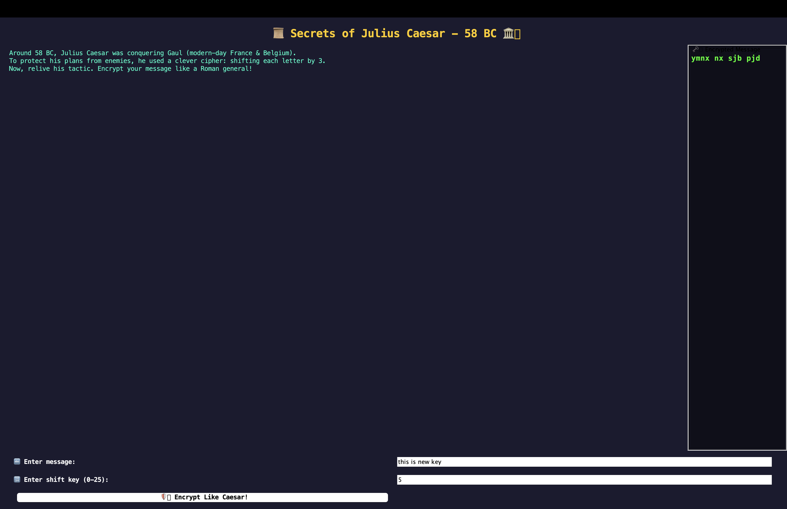

---

### 🌐 HTML View (For GitHub Pages or personal site)

Here’s an HTML version of the same README content for use in a webpage or live preview:

```html
<!DOCTYPE html>
<html lang="en">
<head>
  <meta charset="UTF-8" />
  <title>Caesar Cipher - Secrets of 58 BC</title>
  <style>
    body { font-family: Arial, sans-serif; padding: 2rem; line-height: 1.6; background-color: #fdfdfd; color: #333; }
    h1, h2 { color: #444; }
    code { background: #f2f2f2; padding: 2px 6px; border-radius: 4px; }
    pre { background: #f2f2f2; padding: 1rem; border-radius: 6px; overflow-x: auto; }
    img { max-width: 100%; }
  </style>
</head>
<body>

<h1>🛡️ Caesar Cipher - Secrets of 58 BC</h1>

<p>A modern Java Swing-based GUI application to encrypt and decrypt text using the <strong>Caesar Cipher</strong> technique. Enter your secret message and shift value to encode or decode messages just like the Romans did! 🏛️</p>

<h2>✨ Features</h2>
<ul>
  <li>🔐 Encrypt and decrypt messages using Caesar Cipher logic</li>
  <li>🖥️ Clean GUI built with Java Swing</li>
  <li>✏️ User-defined shift value</li>
  <li>📜 Scrollable output for longer text</li>
  <li>⚡ Instant result on button click</li>
  <li>🧠 Educational for learning basic cryptography</li>
</ul>

<h2>📸 GUI Preview</h2>


<h2>🚀 Getting Started</h2>

<h3>📦 Prerequisites</h3>
<ul>
  <li>Java JDK 8 or higher</li>
  <li>Any Java IDE (e.g., IntelliJ, Eclipse, NetBeans)</li>
</ul>

<h3>🔧 Installation</h3>
<pre><code>git clone https://github.com/Nimarjot1/Caesar_Cipher.git
cd Caesar_Cipher</code></pre>
<p>Open <code>cypher.java</code> in your IDE and run the program.</p>

<h2>🛠️ How It Works</h2>
<p>The Caesar Cipher shifts each letter in the plaintext a fixed number of positions forward or backward in the alphabet.</p>
<p>For example, with a shift of 3:</p>
<ul>
  <li>A → D</li>
  <li>B → E</li>
  <li>Z → C</li>
</ul>

<h2>💡 Example</h2>
<p><strong>Input:</strong> HELLO WORLD</p>
<p><strong>Shift:</strong> 3</p>
<p><strong>Encrypted:</strong> KHOOR ZRUOG</p>
<p><strong>Decrypted:</strong> HELLO WORLD</p>

<h2>📂 Project Structure</h2>
<pre><code>Caesar_Cipher/
├── cypher.java         # Java Swing GUI and Cipher logic
└── README.md           # Project info</code></pre>

<h2>👤 Author</h2>
<p><strong>Nimarjot Kaur</strong><br>
📍 <a href="https://github.com/Nimarjot1">GitHub Profile</a></p>

<h2>📄 License</h2>
<p>This project is open source and available under the <a href="LICENSE">MIT License</a>.</p>

</body>
</html>
